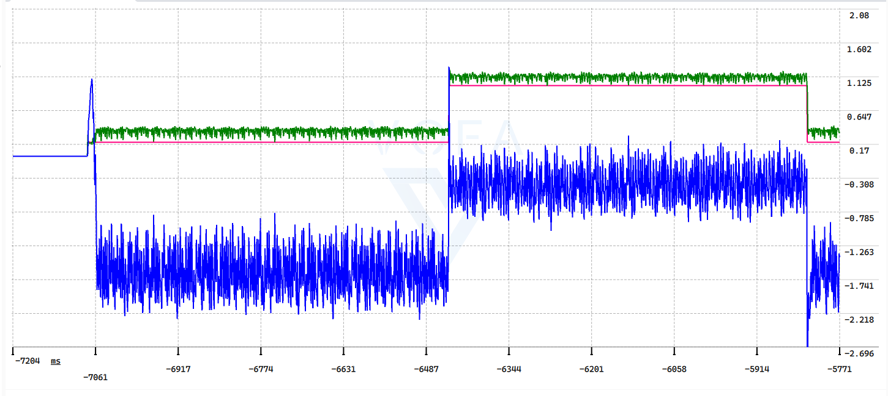
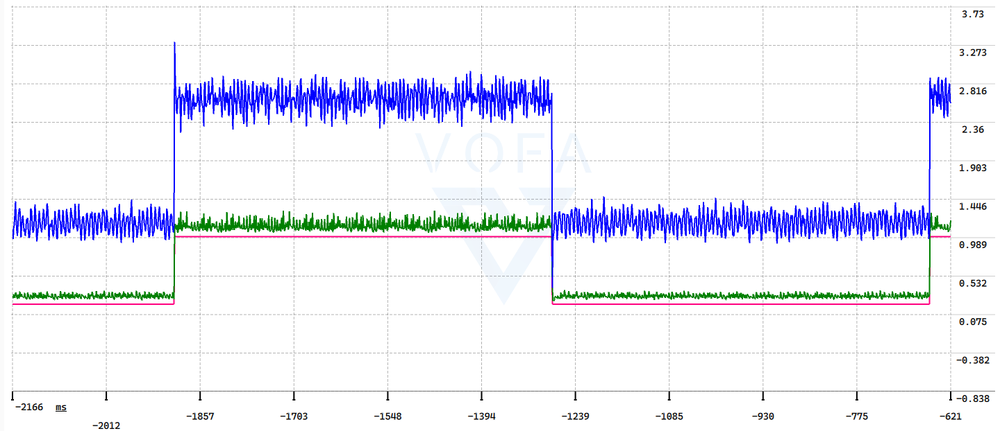

# 实验信息

| 项目 | 内容 |
| --- | --- |
| 设备编号 | 01 |
| 电机型号 | 2804直流无刷电机 |
| 驱动板型号 | 开源广场基于simple FOC的一体控制器 |
| 编码器型号 | as5600 |
| 控制方式 | 有感foc三环控制 |
| 测试日期 | 2026-06-22 |
| 记录人 | 銘 |

# 实验目标

- 本次要解决的问题：as5600编码器与MING_foc的融合
- 预期结果：达成闭环定角度和定速度

# 参数记录

| 参数 | 当前值 | 备注 |
| --- | --- | --- |
| 电流环 Kp | 1.621 | 待定 |
| 电流环 Ki | 4,806.637 | 待定 |
| 速度环 Kp | 0.002 | 待定 |
| 速度环 Ki | 0.05 | 待定 |
| 位置环 Kp | 30.0 | 待定 |
| 位置环 Ki | 1.0 | 待定 |
| 最大电流 | 20 | 待定 |
| 最大速度 | 待测 | 待定 |

# 观察记录

## 2026-06-22

### 现象

- 闭环的时候电机失速，速度会上升到很高，但是电机比较抖动

### 测试步骤

1. 先确保as5600编码器正常
2. 然后确保电流采样正常
3. 再测试电流环正常
4. 最后测试闭环定角度定速度

### 原始日志

```txt
```

### 分析

- 
- 

### 结论

- 闭环的电流采样和处理的逻辑没有跟开环同步

原始代码
```
    // 1. 电流校准（减去零点偏移）
    motor->i_uvw.v = -(float)((int32_t)motor->i_adc_u - motor->i_cali_uvw.u) * CURRENT_SCALE;
    motor->i_uvw.u = (float)((int32_t)motor->i_adc_w - motor->i_cali_uvw.w) * CURRENT_SCALE;
    // 2. 电流限幅（保护电机）
    if(fabs(motor->i_uvw.v) >= CURRENT_LIMIT)
    {
        motor->i_uvw.v = motor->i_uvw.v > 0 ? CURRENT_LIMIT : -CURRENT_LIMIT;
        foc_state = FOC_ERR_OVERCURRENT;
    }

    if(fabs(motor->i_uvw.u) >= CURRENT_LIMIT)
    {
        motor->i_uvw.u = motor->i_uvw.u > 0 ? CURRENT_LIMIT : -CURRENT_LIMIT;
        foc_state = FOC_ERR_OVERCURRENT;
    }
```

正确代码
```
    // 1. 电流校准（减去零点偏移）
    motor->i_uvw.u = (float)((int32_t)motor->i_adc_u - motor->i_cali_uvw.u) * CURRENT_SCALE;
    motor->i_uvw.w = (float)((int32_t)motor->i_adc_w - motor->i_cali_uvw.w) * CURRENT_SCALE;
    // 2. 电流限幅（保护电机）

    if(fabs(motor->i_uvw.u) >= CURRENT_LIMIT)
    {
        motor->i_uvw.u = motor->i_uvw.u > 0 ? CURRENT_LIMIT : -CURRENT_LIMIT;
        foc_state = FOC_ERR_OVERCURRENT;
    }

    if(fabs(motor->i_uvw.w) >= CURRENT_LIMIT)
    {
        motor->i_uvw.w = motor->i_uvw.w > 0 ? CURRENT_LIMIT : -CURRENT_LIMIT;
        foc_state = FOC_ERR_OVERCURRENT;
    }
```

### 待验证

- [ ] 速度环是否正常
- [ ] 电流环是否正常

## 2026-6-25

### 现象
- 电流环的q轴实际值始终高于目标值0.13左右，并且实际值有些震荡，震荡幅度在0.181左右，输出值在负值，震荡幅度更大，幅度在1.17。（红：目标值，绿：实际值，蓝：输出值）

### 测试步骤
1. 固定 q 轴电流目标值，记录未加入电角度偏移时的pi_q.target、i_dq.q、pi_q.output。        
2. 在闭环电角度中加入电角度偏移补偿，例如-2.0f rad。
3. 重新采集 pi_q.target、i_dq.q、i_dq.d 或pi_q.output 波形。
4. 对比补偿前后 q轴实际电流是否更贴近目标值、d轴电流是否更接近 0。
5. 围绕当前有效值继续细调偏移量，例如-1.8f ~ -2.2f，选择电流跟踪最好、震动和异响最小的补偿值。
### 原始日志

红色：pi_q.target
绿色：i_dq.q
蓝色：pi_q.output

i_dq.q 长期高于 pi_q.target 约 0.13A      
i_dq.q 震荡幅度约 0.181A
pi_q.output 长期为负，震荡幅度约 1.17  

### 分析
q 轴实际电流高于目标值时，PI 输出为负是正常现象，表示控制器正在反向调节电压以降低 q 轴电流。但实际电流仍长期偏高，并伴随明显震荡，说明当前电流环存在稳态误差和动态震荡。

可能原因包括：
- q 轴电流 PI 参数偏激，导致输出震荡；    
- 电流采样存在噪声或偏置误差；
- 电角度补偿仍未完全精确；
- 电流环输出限幅或积分项设置不合适。

### 结论
- q 轴电流环本身具备跟踪能力，但在未加入电角度偏移补偿时，实际 q轴电流长期高于目标值并伴随震荡，说明 d/q 轴存在相位偏差。加入约 -2.0f rad电角度偏移后，i_dq.q与目标值明显重合，i_dq.d 接近 0，说明主要 问题来自电角度零点偏移，而不是电流环 PI 参数本身。
- 最终电流环输出震荡幅度缩小到0.39，缩小了77%

### 待验证


