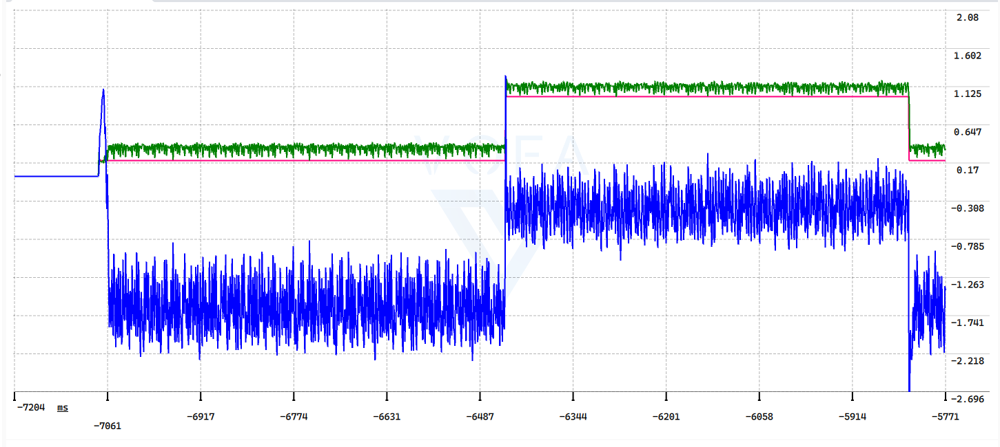
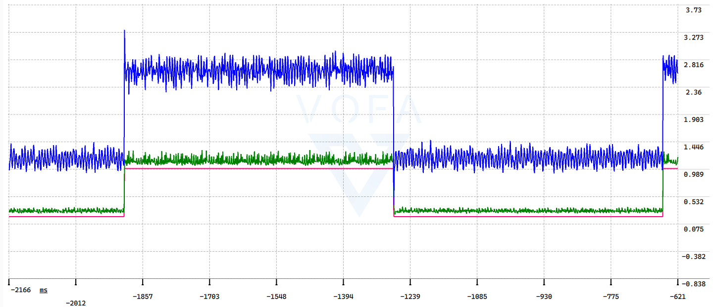
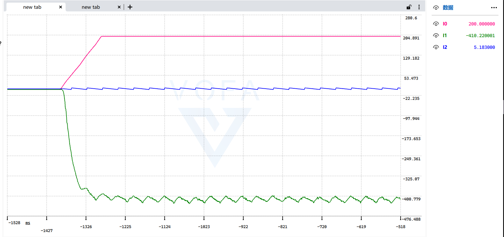
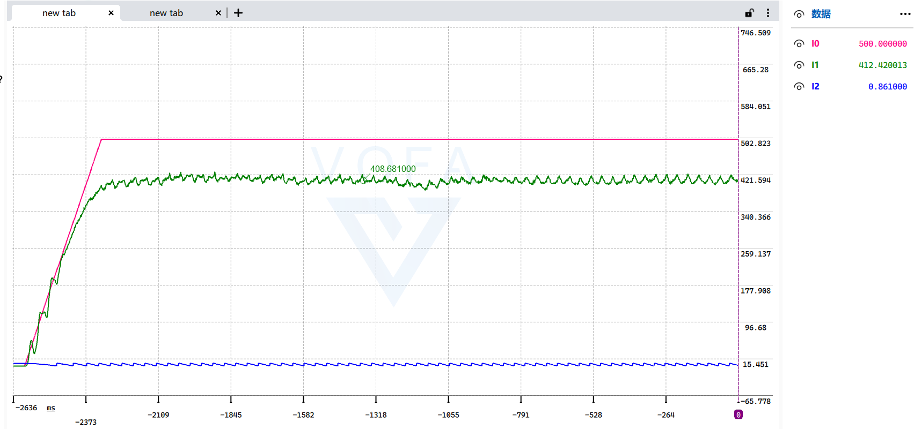
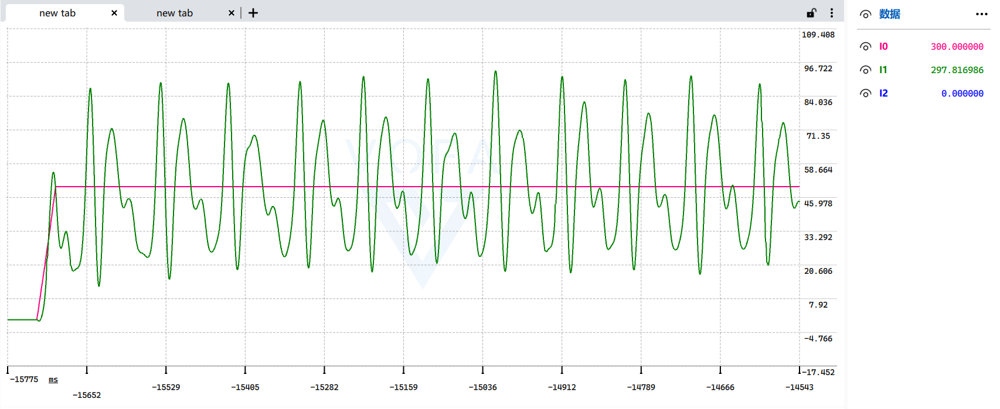
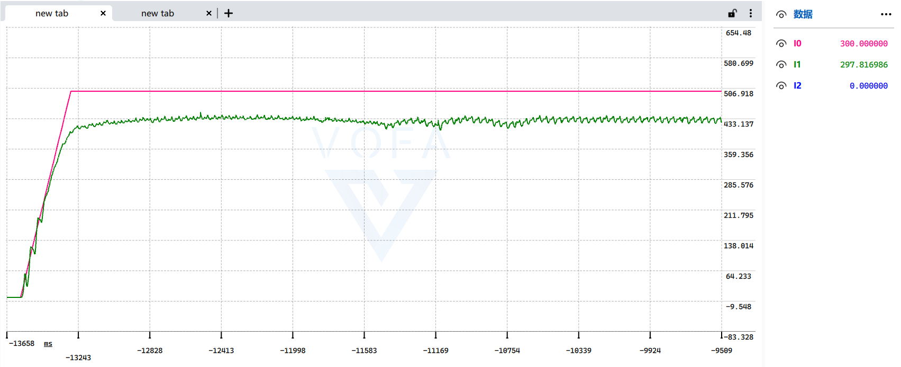

# 实验信息

| 项目 | 内容 |
| --- | --- |
| 设备编号 | 01 |
| 电机型号 | 2804直流无刷电机 |
| 驱动板型号 | 开源广场基于simple FOC的一体控制器 |
| 编码器型号 | as5600 |
| 控制方式 | 有感foc三环控制 |
| 测试日期 | 2026-06-22 |
| 记录人 | 銘 |

# 实验目标

- 本次要解决的问题：as5600编码器与MING_foc的融合
- 预期结果：达成闭环定角度和定速度

# 参数记录

| 参数 | 当前值 | 备注 |
| --- | --- | --- |
| 电流环 Kp | 1.621 | 待定 |
| 电流环 Ki | 4,806.637 | 待定 |
| 速度环 Kp | 0.002 | 待定 |
| 速度环 Ki | 0.05 | 待定 |
| 位置环 Kp | 30.0 | 待定 |
| 位置环 Ki | 1.0 | 待定 |
| 最大电流 | 20 | 待定 |
| 最大速度 | 待测 | 待定 |

# 观察记录

## 2026-06-22

### 现象

- 闭环的时候电机失速，速度会上升到很高，但是电机比较抖动

### 测试步骤

1. 先确保as5600编码器正常
2. 然后确保电流采样正常
3. 再测试电流环正常
4. 最后测试闭环定角度定速度

### 结论

- 闭环的电流采样和处理的逻辑没有跟开环同步

原始代码
```
    // 1. 电流校准（减去零点偏移）
    motor->i_uvw.v = -(float)((int32_t)motor->i_adc_u - motor->i_cali_uvw.u) * CURRENT_SCALE;
    motor->i_uvw.u = (float)((int32_t)motor->i_adc_w - motor->i_cali_uvw.w) * CURRENT_SCALE;
    // 2. 电流限幅（保护电机）
    if(fabs(motor->i_uvw.v) >= CURRENT_LIMIT)
    {
        motor->i_uvw.v = motor->i_uvw.v > 0 ? CURRENT_LIMIT : -CURRENT_LIMIT;
        foc_state = FOC_ERR_OVERCURRENT;
    }

    if(fabs(motor->i_uvw.u) >= CURRENT_LIMIT)
    {
        motor->i_uvw.u = motor->i_uvw.u > 0 ? CURRENT_LIMIT : -CURRENT_LIMIT;
        foc_state = FOC_ERR_OVERCURRENT;
    }
```

正确代码
```
    // 1. 电流校准（减去零点偏移）
    motor->i_uvw.u = (float)((int32_t)motor->i_adc_u - motor->i_cali_uvw.u) * CURRENT_SCALE;
    motor->i_uvw.w = (float)((int32_t)motor->i_adc_w - motor->i_cali_uvw.w) * CURRENT_SCALE;
    // 2. 电流限幅（保护电机）

    if(fabs(motor->i_uvw.u) >= CURRENT_LIMIT)
    {
        motor->i_uvw.u = motor->i_uvw.u > 0 ? CURRENT_LIMIT : -CURRENT_LIMIT;
        foc_state = FOC_ERR_OVERCURRENT;
    }

    if(fabs(motor->i_uvw.w) >= CURRENT_LIMIT)
    {
        motor->i_uvw.w = motor->i_uvw.w > 0 ? CURRENT_LIMIT : -CURRENT_LIMIT;
        foc_state = FOC_ERR_OVERCURRENT;
    }
```

### 待验证

- [ ] 速度环是否正常
- [ ] 电流环是否正常

## 2026-6-25

### 现象
- 电流环的q轴实际值始终高于目标值0.13左右，并且实际值有些震荡，震荡幅度在0.181左右，输出值在负值，震荡幅度更大，幅度在1.17。（红：目标值，绿：实际值，蓝：输出值）

### 测试步骤
1. 固定 q 轴电流目标值，记录未加入电角度偏移时的pi_q.target、i_dq.q、pi_q.output。        
2. 在闭环电角度中加入电角度偏移补偿，例如-2.0f rad。
3. 重新采集 pi_q.target、i_dq.q、i_dq.d 或pi_q.output 波形。
4. 对比补偿前后 q轴实际电流是否更贴近目标值、d轴电流是否更接近 0。
5. 围绕当前有效值继续细调偏移量，例如-1.8f ~ -2.2f，选择电流跟踪最好、震动和异响最小的补偿值。
### 原始日志

红色：pi_q.target
绿色：i_dq.q
蓝色：pi_q.output

i_dq.q 长期高于 pi_q.target 约 0.13A      
i_dq.q 震荡幅度约 0.181A
pi_q.output 长期为负，震荡幅度约 1.17  

### 分析
q 轴实际电流高于目标值时，PI 输出为负是正常现象，表示控制器正在反向调节电压以降低 q 轴电流。但实际电流仍长期偏高，并伴随明显震荡，说明当前电流环存在稳态误差和动态震荡。

可能原因包括：
- q 轴电流 PI 参数偏激，导致输出震荡；    
- 电流采样存在噪声或偏置误差；
- 电角度补偿仍未完全精确；
- 电流环输出限幅或积分项设置不合适。

### 结论
- q 轴电流环本身具备跟踪能力，但在未加入电角度偏移补偿时，实际 q轴电流长期高于目标值并伴随震荡，说明 d/q 轴存在相位偏差。加入约 -2.0f rad电角度偏移后，i_dq.q与目标值明显重合，i_dq.d 接近 0，说明主要 问题来自电角度零点偏移，而不是电流环 PI 参数本身。
- 最终电流环输出震荡幅度缩小到0.39，缩小了77%

### 待验证
- [ ] 电流环有震荡的原因

## 2026-06-26

### 现象
- 速度为负值，完全不跟随目标速度。（I0：目标值，I1：实际值，I2：电机机械角度）

### 测试步骤
1. 确认逻辑链路没有问题
2. 打印编码器测出的速度
### 原始日志

I0：speed_ramp_target
I1：speed
I2：sensor_mech.angle

I0在200
I1在-400到-425之间进行周期性波动  

### 分析
机械角度周期性变化，没有畸变，说明编码器正常。

可能原因包括：
- 编码器测出的速度与目标速度符号不对应

### 结论
- 编码器出来的速度是负数，与目标速度符号不匹配，导致电机无法跟随目标速度

### 现象
- 速度在400rpm内可以正常跟随，超过400rpm速度无法跟随目标速度

### 测试步骤
1. 确认逻辑链路没有问题
2. 打印编码器测出的速度
### 原始日志

I0：speed_ramp_target

I1：speed

I2：sensor_mech.angle

I0在500
I1在400到420之间进行周期性波动  

### 分析
机械角度周期性变化，没有畸变，说明编码器正常。

可能原因包括：
- 编码器测出的速度与目标速度符号不对应

### 结论
- 编码器出来的速度是负数，与目标速度符号不匹配，导致电机无法跟随目标速度

## 2026-07-4

### 现象
- 电机始终无法跟踪目标速度
### 测试步骤
1. 用vofa检测编码器的数据
### 原始日志
解算的速度是0
### 分析
- 速度数据为0，说明编码器没有正常工作，导致电机无法跟踪目标速度
### 结论
在处理编码器数据的时候，时间单位用错了，导致速度无限接近于0

### 现象
- 电机低速会来回摆动，中速会抖震，无法达到高速
### 测试步骤
1. 用vofa检测监测编码器解算的速度和目标速度
2. 用示波器观测foc中断运行时间
### 原始日志
低速波动很大

中速波动很小，但是会抖动

无法达到高速，上限在435rpm左右

示波器显示foc中断频率是10khz，而设置的是20khz
中断运行时间为82.51us


### 分析
- 上限被卡估计是实际时间间隔跟定义的dt不一样，也就是说foc运算时间过长导致这次中断运行的时间盖过了下次中断的到来导致频率减半，低速估计是与pi参数有一定关系
- 估计要定点化来解决此问题

### 结论

## 2026-07-4

### 现象 
- 怎么都无法降到50us以下
### 分析
- 准备标幺化，然后进行定点化处理，但是在此之前最好先把架构处理好

## 2026-07-10

### 代码调整
本轮架构优化结束后，已经达到下面这些状态：     

1. 初始化入口统一
2. 命令入口统一
3. 快环 / 慢环边界固定
4. FOC 核心不直接访问外设
5. 遥测通过快照接口输出
6. 电流前处理只有一个入口
7. 电角度与 trig 只有一个最终生成点
8. 单位边界明确
9. 速度/角度换算只走公共 helper
10. 工程可稳定 0 warning 构建

本轮未直接进入标幺化，而是先完成了控制架构收口 
：统一了初始化与命令入口，分离了快慢环职责，移 
除了 FOC 核心对 AS5600 的直接依赖，集中化了电流
前处理、角度生成与单位换算边界，并清理了遗留   
warning，使工程达到 0 Error / 0 Warning        
的稳定状态。
在此基础上，后续可以按“电流采样边界 → 电压边界 
→ 速度环边界”的顺序逐步推进标幺化，而不必再先做
额外的大规模结构重构。


# 实验信息

| 项目 | 内容 |
| --- | --- |
| 设备编号 | 02 |
| 电机型号 | 水下直流无刷电机 |
| 驱动板型号 | 自制大功率驱动板 |
| 编码器型号 | 无 |
| 控制方式 | 无感foc三环控制 |
| 测试日期 | 2026-07-15 |
| 记录人 | 銘 |

# 实验目标

- 本次要解决的问题：电机转速上限只有一半
- 预期结果：能转到3000rpm以上

# 参数记录

| 参数 | 当前值 | 备注 |
| --- | --- | --- |
| 电流环 Kp | 0.56418 | 待定 |
| 电流环 Ki | 2793.022 | 待定 |
| 速度环 Kp | 0.005 | 待定 |
| 速度环 Ki | 0.4 | 待定 |
| 位置环 Kp | 无 | 待定 |
| 位置环 Ki | 无 | 待定 |
| 最大电流 | 20 | 待定 |
| 最大速度 | 待测 | 待定 |

## 2026-07-4

### 现象
发现时间间隔参数有问题，修正之后电机无法闭环

### 原始日志
Ts原始为0.00008，改为0.00004
其余各环的积分参数都放大一倍

### 分析
应该是参数的问题，在0.00008时，电机能正常闭环，且高速抖动较小，水下表现一般，能转的地步，所以判断代码的问题并不大

### 结论

## 2026-8-7

### 现象
调试完电流环和滑模参数之后，进入闭环调试速度环，但是速度环不管怎么调进入闭环的时候电机会停转一下，然后速度才会慢慢回到正常

### 结论
开环切闭环的时候速度积分参数为0，设置为0.3的时候就正常了

### 现象
速度被卡在3100上不去

### 结论
电流环限幅太小，设置成12之后可以到达5500不撞限幅


