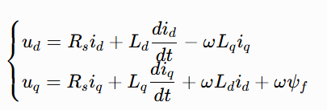

# 群友遇到的问题
## 问题1：
有没有人知道自己做无刷电机驱动板的时候，只使用电流环，在低速的时候无论给的目标电流多大他都能很好的跟随而且转的很好，但是速度一旦到了某种程度就会疯狂抖动但是我要是用手给他按住不让他速度那么快他的电流环又依然能很好的跟随，但是电流环不是只和扭矩有关吗和速度有什么关系啊。有没有大佬能传授一下。

## 原因：

- 在只有电流环的时候，转速越快，ω越大，电机dq电压方程的dq交叉耦合项的扰动就越大，同时反电动势也越大，这两个因素会同时冲击电流环，导致电机抖动。
- 转速越快，电角度变化越快，adc采样频率是固定的，会引起角度相位延迟，影响park变换，进而影响svpwm输出,电流会有所扰动，最终导致电机抖动。

## 解决办法：
增加反电动势前馈、dq 耦合解耦前馈，同时提升电流环带宽、减小控制采样延时。

## 问题2
面试问的那种高速啸叫低速抖动是什么原因？

## 原因：
低速抖动核心 3 大类：
- 控制算法：缺少 dq 耦合 / 反电动势前馈，低速相位延时导致 Park 解耦失效；电流环 PI 参数不匹配；电流采样零点误差放大。
- 电机本体：齿槽转矩周期性波动，低速下转矩波动直观体现为抖动。
- 机械结构：传动间隙、低惯量负载放大微小转矩波动。

高速啸叫核心 3 大类：
- PWM 载波谐波：SVPWM 调制引入载波高频谐波，产生交变电磁力，激发机壳共振啸叫。
- 高速耦合扰动：转速升高 dq 交叉耦合电压急剧增大，无前置前馈时 d/q 电流高频震荡。
- 机械共振 / 弱磁失稳：谐波频率匹配电机固有谐振点；高速弱磁区间控制参数失稳加剧电流波动。

## 解决办法：
低速抖动优化方案
- 增加 dq 耦合前馈、反电动势前馈，从电压方程层面抵消交叉扰动；
- 匹配电流环 PI，低速减小积分作用，加入积分限幅防饱和；
- 校准电流采样零点，减小 AD 延时，同步采样时序；
- 电机采用斜极、斜槽削弱齿槽转矩；消除传动间隙。

高速啸叫优化方案
- 提高 PWM 载波频率，避开电机机械共振频段；
- 完善前馈解耦，提升电流环带宽，抑制高频电流波动；
- 优化弱磁控制逻辑，合理限制输出电压；
- 定子铁芯浸漆、优化机壳结构，改变固有谐振频率避开谐波区间。

## 问题3
电流环带宽跟电机时间常数有关吗？

## 答案
电流环带宽与电机的电气时间常数（又称电磁时间常数）直接相关，是决定电流环理论极限带宽的核心固有约束；而与电机的机械时间常数基本无关。
1. 核心关联的本质：电流环的被控对象是 RL 电路
电流环的控制目标是快速跟踪定子电流指令，其直接被控对象是电机定子的电阻 - 电感（RL）串联回路，电机的电气特性直接决定了被控对象的惯性大小。
电机电气时间常数定义为：
$$
\tau_e = \frac{L_s}{R_s}
$$
其中 $L_s$ 为定子相电感， $R_s$ 为定子相电阻。它反映了阶跃电压下电流自然上升的快慢：时间常数越小，电流本身的固有响应速度越快。
开环状态下，RL 电路是标准一阶惯性环节，其固有转折频率（幅频特性 - 3dB 频率）为：
$$
f_e = \frac{1}{2\pi \tau_e} = \frac{R_s}{2\pi L_s}
$$
这是电机自身电流响应的动态基准，也是电流环带宽设计的底层出发点。

2. 闭环带宽与电气时间常数的定量关系
工程上电流环普遍采用 PI 调节器，按典型 I 型系统整定，核心思路是用 PI 调节器的零点抵消 RL 惯性的极点，从而突破开环固有频率的限制、提升闭环响应速度。
理想对消极点后，闭环电流环可等效为纯一阶系统，理论带宽可以远超电机固有转折频率 $f_e$ 。
但实际系统中存在 PWM 零阶保持延迟、采样计算延迟、逆变器死区等小惯性环节，再加上母线电压对电流变化率（di/dt=u/L）的物理限制，带宽无法无限提升。
工程规律上：
- 小电感电机（如高速伺服电机、空心杯电机）：$\tau_e$ 小，电流环可轻松做到数百 Hz 甚至 kHz 级带宽；
- 大电感电机（如低速大转矩电机、步进电机）：$\tau_e$ 大，即便调节器参数拉满，带宽也很难做高，强行提升会导致超调、振荡甚至不稳定。

## 问题4
请教一下，你们测电流环带宽用的都是什么方法？

## 答案
- 正弦扫频法（正弦扫频fft伯特图） —— 实验室基准方法
这是精度最高的经典测试方案，也是行业内的性能标定标准。

- 原理
在电流环给定值上叠加不同频率的小幅值正弦扰动，保持扰动幅值恒定，逐点测量输出电流的幅值与相位差，绘制完整的幅频 / 相频特性曲线，直接读取 - 3dB 对应的频率。

- 测试步骤
工况准备：将电机转子机械堵转锁死，消除反电动势对电流环的扰动，确保测试对象为纯电流闭环。通常优先选择 d 轴电流环测试（表贴式永磁电机 d 轴电流不产生转矩，堵转更安全）。
信号注入：在直流电流偏置上叠加正弦小信号，即 I_ref = I_dc + A·sin(2πft)。直流偏置I_dc避免电流过零非线性；扰动幅值A一般取额定电流的 5%~10%，保证系统工作在线性区。
逐点扫频：从低频（数 Hz）开始逐步提高正弦信号频率，每个频率点等待响应稳定后，记录输出电流的幅值和输入输出相位差。
带宽读取：以频率为横轴、20lg(输出幅值/输入幅值)为纵轴绘制幅频曲线，曲线上增益为 - 3dB 对应的频率即为闭环带宽。

- 优缺点
优点：精度最高，可同时得到幅频、相频完整特性，能全面反映电流环动态性能。
缺点：测试周期长，需逐频点等待稳定；适合实验室离线标定，不适合现场快速测试。
